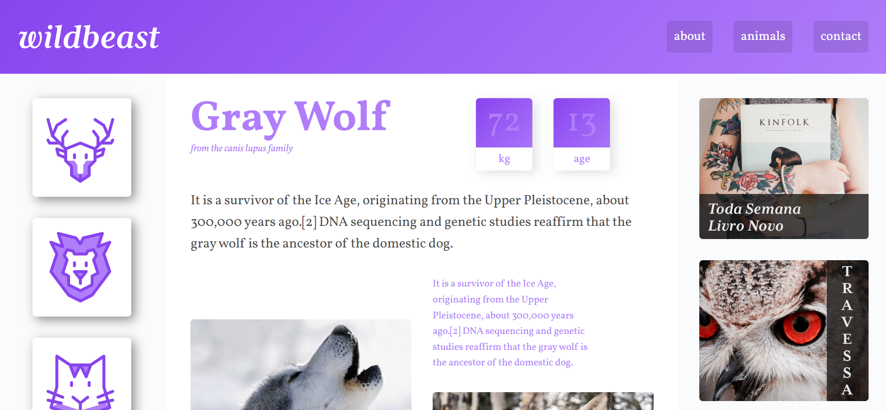

# Wildbeast 🐾

**Wildbeast** is a clean, responsive website built using modern **CSS Grid** techniques. This project was created as part of a CSS Grid course to practice layout design and demonstrate how powerful and flexible grid-based layouts can be.

## 🚀 Live Demo

You can view the live site here: [https://your-username.github.io/wildbeast](https://your-username.github.io/wildbeast)

## 📸 Preview



## 🛠️ Features

- Fully responsive layout
- Built with semantic HTML5 and modern CSS
- Clean, minimalist design
- Utilizes CSS Grid for structure and alignment
- Easily extendable for personal or portfolio projects

## 🧰 Technologies Used

- HTML5
- CSS3
- CSS Grid

## 📁 Folder Structure

```plaintext
wildbeast/
├── index.html
├── style.css
├── assets/
│   └── images/
├── README.md
└── screenshot.png
```

## 🧑‍💻 Getting Started
To view or edit this project locally:

1. Clone the repository:

```bash
git clone https://github.com/your-username/wildbeast.git
```
2. Open the index.html file in your browser or a code editor.

No build tools or dependencies required – it's all static!

## 🤝 Contributing
This project is for learning purposes, but feel free to fork it or suggest improvements.

## 📄 License
This project is open source and available under the MIT License.